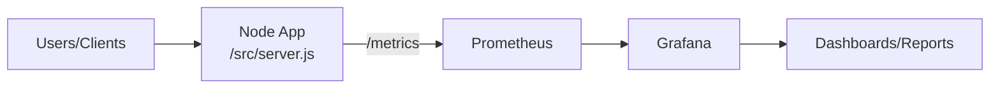

# Monitoring Data Flow Diagram

Explanation:
- The Node app exposes `/metrics`.
- Prometheus scrapes those metrics on a schedule.
- Grafana reads from Prometheus and shows charts.
- Reports are created from the dashboards.
